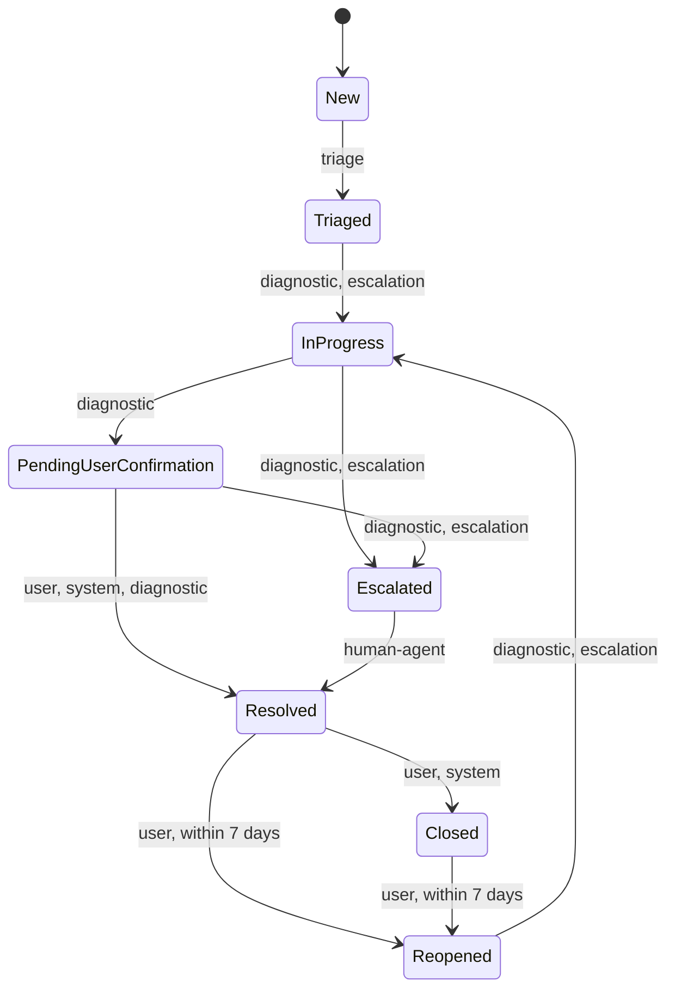
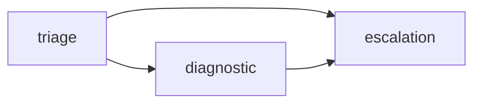

# Help desk agent ecosystem

A deterministic help desk ticket core exposed as a Node.js MCP server
(`src/`), driven by agent definitions generated for three editor platforms —
VS Code (Copilot), Claude Code, and OpenCode. Users describe a problem in
plain language; an agent classifies it into one of three support categories,
the server computes a priority and SLA from severity × urgency, and — for a
connectivity symptom — a diagnostic agent runs a safe, allowlisted check and
either fixes it or hands the ticket to a human team. The MCP server owns
every business rule (classification math, state transitions, redaction,
remediation safety, audit); the generated agents, commands, and the shared
skill only tell an agent **which tool to call when** (ADR 0003).

## Contents

- [Quick start (Claude Code)](#quick-start-claude-code)
- [How it works](#how-it-works)
  - [Ticket lifecycle](#ticket-lifecycle)
  - [Triage & priority](#triage--priority)
  - [MCP tools](#mcp-tools)
  - [Agents & handoffs](#agents--handoffs)
  - [Diagnosis & auto-remediation](#diagnosis--auto-remediation)
  - [Security & privacy](#security--privacy)
  - [Audit trail](#audit-trail)
- [What this covers, and where](#what-this-covers-and-where)
- [Architecture](#architecture)
- [Requirements & setup](#requirements--setup)
- [Per-platform usage](#per-platform-usage)
- [Generator workflow](#generator-workflow)
- [Testing](#testing)
- [Data files](#data-files)
- [Known limitations](#known-limitations)
- [Architecture decisions](#architecture-decisions)

## Quick start (Claude Code)

```sh
npm install
export HELPDESK_PSEUDONYM_KEY="$(openssl rand -hex 32)"
claude
```

Claude Code reads `.mcp.json` and will ask to approve the project MCP server
`helpdesk` the first time it starts (it launches `npx tsx
src/app/mcp/main.ts` and reads `HELPDESK_PSEUDONYM_KEY` from the
environment). Once approved, try the generated commands from
`.claude/commands/`:

| Command | What it does |
|---|---|
| `/new-ticket "I can't connect to the VPN from home"` | Files a new ticket and triages it (category, severity, priority, SLA), then stops. |
| `/helpdesk-run "I can't connect to the VPN from home"` | Runs the same triage step, then automatically continues through `diagnostic` and, if needed, `escalation` — up to 3 agent invocations for one ticket. Its argument is the free-text issue description, not a ticket id: it starts a brand-new ticket end to end. |
| `/ticket-status <ticketId>` | Read-only: reports the ticket's current state and triage data. Grab `<ticketId>` from a prior command's reply. |

Afterward, inspect the runtime state under `data/` (gitignored, created on
first run): `data/tickets.json` (the ticket store) and `data/audit.jsonl`
(the hash-chained audit log — see [Audit trail](#audit-trail)).

**Forcing a specific probe outcome.** The connectivity probe defaults to
`--mode mock --mock-scenario reachable`, so `run_diagnostic` normally
succeeds. To exercise a different branch deterministically, set
`HELPDESK_PROBE_MOCK_SCENARIO` to one of `reachable`, `unreachable`,
`degraded`, `hang`, `crash`, or `malformed` before starting `claude` (the
MCP server forwards it to the probe's child process):

```sh
HELPDESK_PROBE_MOCK_SCENARIO=unreachable claude
```

Operators can also run the same probe standalone, outside the MCP server:

```sh
npm run probe -- --target tcp://vpn.example.com:443 --mode mock --mock-scenario unreachable
```

## How it works

### Ticket lifecycle

States: `New`, `Triaged`, `InProgress`, `PendingUserConfirmation`,
`Escalated`, `Resolved`, `Closed`, `Reopened`.



- **Forward-only for agents.** An agent actor (`triage`, `diagnostic`,
  `escalation`) may only move a ticket to a strictly higher-ranked state
  (`New` < `Triaged`/`Reopened` < `InProgress` < `PendingUserConfirmation` <
  `Escalated` < `Resolved` < `Closed`), checked independently of which
  transitions the table below lists. `user`, `human-agent`, and `system` are
  not bound by this rank check.
- **`Reopened` is user-only.** No agent actor may reopen a ticket.
- **Resolution conditions** differ by `basis`: `user-confirmed` needs a
  fresh diagnostic re-check (`status: "reachable"`, finished after the fix
  was applied); `auto-timeout` needs 48 elapsed hours **and** a low-risk
  ticket (allowlisted remediation, `P3`, not `access-identity`); `human-agent`
  just needs the ticket to be `Escalated`.
- **Reopen window:** 7 days (168 hours, inclusive) from `resolution.resolvedAt`.
  Past that, `update_ticket` fails with `REOPEN_WINDOW_EXPIRED`, and the
  suggested recovery is `create_ticket` with `relatedTicketId`.

See [AGENTS.md](AGENTS.md) § Ticket lifecycle for the full transition table
(every payload field per transition) instead of duplicating it here.

### Triage & priority

Priority is computed from a severity × urgency matrix
(`src/tickets/domain/priority.ts`):

| Severity ↓ / Urgency → | high | medium | low |
|---|---|---|---|
| **high** | P1 | P1 | P2 |
| **medium** | P1 | P2 | P3 |
| **low** | P2 | P3 | P3 |

Each priority carries a fixed response/resolution SLA
(`src/tickets/domain/sla.ts`), anchored at `triagedAt` (business days skip
Saturday/Sunday, UTC, no holidays):

| Priority | Response due | Resolution due |
|---|---|---|
| P1 | 1 hour | 4 hours |
| P2 | 4 hours | 1 business day |
| P3 | 1 business day | 3 business days |

### MCP tools

The server advertises exactly 7 tools (`src/app/mcp/tool-names.ts`), one per
business action:

| Tool | What it does | Who calls it |
|---|---|---|
| `create_ticket` | Creates a ticket from free text (redacted before storage); starts in `New`. | `triage` |
| `get_ticket` | Fetches a ticket plus its currently `allowedTransitions`. | any agent, before acting |
| `list_tickets` | Lists tickets filtered by state/category/priority (clamped to 50). | any agent (read-only) |
| `update_ticket` | Applies one state transition; validates actor, payload, and any guard before mutating. | `triage`, `diagnostic`, `escalation`, `user`, `human-agent`, `system` (transition-specific) |
| `append_audit` | Appends a note or decision to a ticket's audit trail; never edits or removes an entry. | any agent, for a decision no other call already recorded |
| `run_diagnostic` | Runs the connectivity probe against the ticket's catalogued service. | `diagnostic` only |
| `apply_remediation` | Applies the allowlisted fix a completed `run_diagnostic` call decided on. | `diagnostic` only |

### Agents & handoffs

| Agent | Capabilities | Hands off to | Holds no capability for |
|---|---|---|---|
| `triage` | `ticket.create`, `ticket.read`, `ticket.update`, `audit.append` | `diagnostic`, `escalation` | diagnosis, remediation |
| `diagnostic` | `ticket.read`, `ticket.update`, `audit.append`, `diagnostic.run`, `remediation.apply` | `escalation` | escalation targeting beyond its own escalate calls |
| `escalation` | `ticket.read`, `ticket.update`, `audit.append` | none (dead end) | diagnosis, remediation, further handoff |



- **Minimal context.** A handoff passes only `ticketId`; the receiving agent
  re-reads everything else itself with `get_ticket` — never a summary,
  transcript, or free-text field.
- **Bounded driver.** Claude Code's `/helpdesk-run` command never invokes
  more than 3 agents total for one ticket (the graph's longest path is 2
  edges, plus one for the starting agent); if that bound is reached without
  a `HANDOFF: none` line, it stops and tells the user a person will follow
  up.
- **Per-platform mechanism.** VS Code (`.github/agents/*.agent.md`) uses
  native declarative `handoffs`. Claude Code subagents end their reply with
  a `HANDOFF: <target> ticket=<id>` line that `/helpdesk-run` reads and acts
  on. OpenCode generates a `helpdesk-orchestrator` primary agent whose
  `permission.task` allows delegating only to `triage`, `diagnostic`, and
  `escalation`, and denies everything else. All three ultimately rely on the
  MCP server, not the platform, to reject a transition the acting role may
  not perform (ADR 0003, ADR 0009).

### Diagnosis & auto-remediation

The service catalog (`config/service-catalog.json`) lists 4 services; one
has no probe at all:

| Service key | Display name | Category / subcategory | Probe |
|---|---|---|---|
| `vpn-gateway` | Corporate VPN gateway | infrastructure-software / vpn | TCP `vpn.example.com:443` |
| `idp` | Identity provider (SSO) | access-identity / account-locked | HTTPS `idp.example.com/healthz` |
| `internal-app` | Corporate internal app | infrastructure-software / corporate-app | HTTPS `app.internal.example.com/health` |
| `shared-drive` | Shared drive provisioning | provisioning-permissions / folder-repo-access | none — no automated check exists |

A completed probe reports one of `reachable`, `degraded`, or `unreachable`.
Only a `reachable` result can match the remediation allowlist
(`src/diagnostics/domain/remediation-allowlist.ts`); everything else
escalates with `not_allowlisted`:

| Category / subcategory (status: `reachable`) | Action | Effect |
|---|---|---|
| access-identity / account-locked | `simulate-account-unlock` | marks the account lock simulated-cleared |
| access-identity / password-reset | `issue-reset-link-marker` | marks a reset link issued |
| infrastructure-software / vpn | `record-service-healthy` | records the VPN verified healthy |
| infrastructure-software / corporate-app | `record-service-healthy` | records the app verified healthy |

Every allowlist action is reversible and mutates only this system's own
simulated `systemState` — never a real credential, identity, or
infrastructure system.

A **runner failure** (the probe itself didn't answer, not "the service is
down") never reaches the allowlist; it always escalates with
`diagnostic_failed` after at most one retry (`timeout` only — every other
failure reason skips the retry):

| Runner failure reason | Meaning |
|---|---|
| `timeout` | The probe did not answer in time. |
| `nonzero_exit` | The probe process crashed or rejected its input. |
| `malformed_output` | The probe answered with output that fails the report schema. |
| `output_too_large` | The probe's stdout exceeded the 64 KiB cap. |
| `spawn_error` | The probe process could not be started at all. |

See [`.claude/skills/connectivity-diagnostic/SKILL.md`](.claude/skills/connectivity-diagnostic/SKILL.md)
for the full step-by-step procedure, escalation-target routing, and error
table the `diagnostic` agent actually follows.

### Security & privacy

- **Redaction before anything is stored, logged, or returned.** An ordered
  pattern set (`src/redaction/domain/patterns.ts`) finds and replaces PEM
  private keys, JWTs, bearer/basic auth headers, URL-embedded credentials,
  AWS/GitHub/Slack tokens, `secret = value`-style assignments (English and
  Spanish keywords), emails, Luhn-checked card numbers, IBANs, national-ID
  shapes, phone numbers, and long high-entropy strings — each becomes a
  typed `[REDACTED:<KIND>]` marker. It runs at four points: inbound MCP
  free-text fields, domain construction (a branded `RedactedText` type
  nothing else can construct), probe stdout/stderr excerpts, and a final
  deep pass over every MCP tool response (ADR 0008).
- **Affected-user pseudonymization.** `triage.affectedUser` is stored as
  `usr_` + a truncated HMAC-SHA256 of the raw identifier, keyed by
  `HELPDESK_PSEUDONYM_KEY`; the raw identifier is never persisted.
- **Probe targets only from the catalog.** `run_diagnostic` resolves the
  host itself from `config/service-catalog.json`; a client- or
  user-supplied host, URL, IP, or port is refused, not probed.
- **Secrets never reach config files or subprocesses.** There is no secret
  in any committed config file. The probe child process only ever receives
  `PATH` and the `HELPDESK_PROBE_*` knobs — the runner explicitly strips any
  key matching `/PSEUDONYM/i` before spawning it, even if one somehow made
  it into the forwarded environment (`src/diagnostics/infrastructure/child-process-diagnostic-runner.ts`).

### Audit trail

Every decision — a transition, a rejected transition attempt, a diagnostic
run, a remediation, an escalation, an agent note — is appended to a
hash-chained log (`src/audit/domain/hash-chain.ts`), persisted as
`data/audit.jsonl`. Each entry holds `id`, `seq`, `at`, `ticketId`, `actor`,
`type`, a redacted `message`, structured `data`, an optional
`redactionFindings` summary, `prevHash`, and `hash`, where
`hash = sha256(prevHash + canonicalJson(entry))` and the first entry's
`prevHash` is a fixed genesis value (64 zeros). Editing, deleting, or
reordering any entry breaks every hash from that point forward when
recomputed. That recomputation exists as a pure function
(`verifyChain` in `src/audit/domain/hash-chain.ts`) exercised by its own
tests; it is not currently wired to a CLI command or an MCP tool.

## What this covers, and where

| PDF requirement | Where it lives |
|---|---|
| Node.js implementation | `package.json` (`engines.node`); the whole `src/` tree |
| Three support categories (access & identity, infrastructure & local software, provisioning & permissions) | `src/tickets/domain/categories.ts`; `AGENTS.md` § Support categories |
| Classification / triage (category, severity → priority, entities: affected user, impacted service) | `triage` agent; `src/tickets/domain/priority.ts`, `src/tickets/domain/sla.ts` |
| Diagnosis & safe auto-remediation | `diagnostic` agent; `.claude/skills/connectivity-diagnostic/SKILL.md`; `src/diagnostics/` |
| Security / privacy (no plaintext credentials, tokens, secrets, PII) | `src/redaction/`; ADR 0008 |
| Escalation & auditable log | `escalation` agent; `src/audit/`; the hash-chained log under `data/` |
| Clear user communication | `AGENTS.md` § Communication rules; each generated agent's own Rules section |
| §2.1 custom instructions for the ticket lifecycle | `AGENTS.md` (read by VS Code and OpenCode natively; `CLAUDE.md` points Claude Code at it) |
| §2.2 agent skill with an auxiliary script | `.claude/skills/connectivity-diagnostic/`; `scripts/connectivity-probe.ts` (ADR 0007) |
| §2.3 ≥2 agents, explicit tools, delegation, acyclic handoffs | `.claude/agents`, `.github/agents`, `.opencode/agents`; `tools/generator/definitions/agents.ts`; the acyclic-graph check itself is `detectHandoffCycle` in `tools/generator/validate.ts`, run at generator build time — `src/architecture.test.ts` is a separate guard that only enforces the domain layer's import boundaries |
| §2.4 parameterized prompt files with variables and tool invocation | `.github/prompts/*.prompt.md` (`${input:var}`), `.claude/commands/*.md`, `.opencode/commands/*.md` (`$ARGUMENTS`) |

## Architecture

Hexagonal architecture per capability (`domain` / `application` / `ports` /
`infrastructure`), organized by business capability, not by technical layer
(Screaming Architecture, ADR 0004):

```
src/
├── tickets/      domain, application, ports, infrastructure
├── diagnostics/  domain, application, ports, infrastructure
├── audit/        domain, application, ports, infrastructure
├── redaction/    domain, ports, infrastructure
├── shared/       cross-cutting kernel (Result, ids, domain-error, ports)
└── app/          composition root, MCP server, config (ADR 0013)
```

```
 VS Code (Copilot)    Claude Code          OpenCode
 .github/agents       .claude/agents       .opencode/agents
 .github/prompts      .claude/commands     .opencode/commands
 .vscode/mcp.json     .mcp.json            opencode.json
        \                   |                    /
         \                  |                   /
          v                 v                  v
              MCP stdio server "helpdesk"
              (src/app/mcp — 7 tools, one per business action)
                            |
        +-------------------+--------------------+
        v                   v                    v
  src/tickets          src/diagnostics       src/audit
  (lifecycle, SLA,     (probe runner,        (append-only,
   priority)            remediation)          hash-chained)
        \                   |                   /
         +---------- src/redaction, src/shared -+

  tools/generator/definitions --[generate]--> the three
  platform trees above (committed, drift-tested).
  .claude/skills/ is hand-written and shared unmodified across all three.
```

The generator (`tools/generator`) reads one set of typed definitions and
renders each platform's format, so a tool rename or a new agent only needs
one edit (ADR 0009). Nothing under a generated platform directory
(`.claude/agents`, `.claude/commands`, `.github/`, `.opencode/`, `.mcp.json`,
`opencode.json`, `.vscode/mcp.json`) is hand-edited — see
[Generator workflow](#generator-workflow).

## Requirements & setup

- Node.js `>=22.12.0` (see `package.json`).

```sh
npm install
```

Environment variables (all optional; the server runs with defaults). There
is no committed `.env.example` in this repository — set these directly, for
example in a local untracked `.env` loaded by your shell or MCP client:

| Variable | Default | Notes |
|---|---|---|
| `HELPDESK_DATA_DIR` | `data` | Where `tickets.json` and `audit.jsonl` are written. |
| `HELPDESK_PROBE_MODE` | `mock` | `mock` reproduces every probe outcome offline (reachable, degraded, unreachable, hang, crash, malformed) without touching a network. Set to `real` to actually connect. |
| `HELPDESK_PROBE_MOCK_SCENARIO` | `reachable` | Only used when `HELPDESK_PROBE_MODE=mock`. One of `reachable`, `unreachable`, `degraded`, `hang`, `crash`, `malformed` — see [Quick start](#quick-start-claude-code). |
| `HELPDESK_PROBE_TIMEOUT_MS` | `3000` | Probe timeout in milliseconds. |
| `HELPDESK_SERVICE_CATALOG` | `config/service-catalog.json` | Which services/hosts a diagnostic may probe. |
| `HELPDESK_PSEUDONYM_KEY` | a built-in dev key | HMAC key used to pseudonymize `affectedUser` (ADR 0008). Unset → one stderr warning per process and a `config.warning` audit entry; set a real secret before any non-local use. |

## Per-platform usage

### VS Code (GitHub Copilot)

- Agents: `.github/agents/*.agent.md` (native `handoffs`) **and**
  `.claude/agents/*.md` — VS Code reads both trees, so each agent name can
  appear twice in its agent picker.

  > **Use the `.agent.md` ones.** Only `.github/agents/*.agent.md` carries
  > the native declarative `handoffs` this platform supports; the
  > `.claude/agents/*.md` copies exist for Claude Code and rely on a
  > prompt-driven `HANDOFF:` line instead.

- Prompts: `.github/prompts/*.prompt.md` (e.g. `/new-ticket`, invoked with a
  free-text `${input:description}`).
- MCP: `.vscode/mcp.json` prompts for `HELPDESK_PSEUDONYM_KEY` via its
  `inputs` block the first time the server starts, instead of reading it
  from the environment.

### Claude Code

- Agents: `.claude/agents/*.md` (subagents; no declarative handoffs — each
  ends its reply with a `HANDOFF: <target> ticket=<id>` line instead).
- Commands: `.claude/commands/*.md`, including `/helpdesk-run` (see
  [Quick start](#quick-start-claude-code) and
  [Agents & handoffs](#agents--handoffs)).
- MCP: `.mcp.json` reads `HELPDESK_PSEUDONYM_KEY` from the environment.

### OpenCode

- Agents: `.opencode/agents/*.md`, plus a generated `helpdesk-orchestrator`
  primary agent whose `permission.task` allows delegating only to the
  helpdesk subagents (`triage`, `diagnostic`, `escalation`) and denies
  everything else.
- Commands: `.opencode/commands/*.md` (`$ARGUMENTS` / `$1`).
- MCP: `opencode.json` reads `HELPDESK_PSEUDONYM_KEY` from the environment.

## Generator workflow

The generated platform files are committed, but never hand-edited:

1. Edit the shared definitions in `tools/generator/definitions/` (agents,
   prompts, or the MCP server entry).
2. `npm run generate` — renders all three platforms' files.
3. `npm run generate:check` — fails if the committed output would differ
   from what `generate` would produce (repo-drift guard, ADR 0009).

## Testing

```sh
npm test        # vitest run — unit, contract, snapshot and drift tests
npm run typecheck
npm run build   # tsc -p tsconfig.build.json
```

## Data files

Runtime state lives under `data/` (gitignored, created on first run):

- `tickets.json` — the ticket store.
- `audit.jsonl` — an append-only, hash-chained audit log; each line's hash
  covers the previous line, so a deleted or edited entry breaks the chain.

## Known limitations

- The MCP server and the connectivity probe currently run through `tsx`
  directly from TypeScript source (`npx tsx src/app/mcp/main.ts`), so
  `tsx` and `typescript` must stay `devDependencies` rather than moving to
  the compiled `dist/scripts/connectivity-probe.js` path ADR 0007 describes.
  Aligning the runtime launch path with that ADR is a pending follow-up.
- Two tests in
  `src/diagnostics/infrastructure/child-process-diagnostic-runner.test.ts`
  (`output_too_large`) fail on Node v24.18 in this environment; every other
  test passes.
- `actor` on every tool call is self-declared by the calling agent — MCP
  has no caller identity in this MVP (ADR 0010). Mitigated, not prevented,
  by per-agent tool lists (an agent literally cannot call a tool it was not
  generated with) and the audit trail.
- Claude Code and OpenCode have no native declarative handoff mechanism;
  their agent-to-agent flow is prompt-driven (a `HANDOFF:` line an
  orchestrator reads), with correctness guaranteed server-side — the MCP
  server rejects any transition the acting role may not perform regardless
  of what the prompt-driven handoff claims (ADR 0003, ADR 0009).
- There is no committed `.env.example` in this repository (see
  [Requirements & setup](#requirements--setup)).
- The audit hash chain can be recomputed and verified (`verifyChain`), but
  that check is not currently exposed as a CLI command or an MCP tool — see
  [Audit trail](#audit-trail).

## Architecture decisions

See [`docs/adr`](docs/adr/README.md) for the full log, including the three
platforms and file-format survey (0002), the MCP-server-as-deterministic-core
decision (0003), hexagonal/screaming layout (0004), the redaction strategy
(0008), the generator design (0009), and actor-scoped transitions (0010).
